# amazonconnect

# Amazon Connect - Auth Flow

This repository contains the Amazon Connect contact flow for self-service IVR system.

---

## 📞 Main Flow Overview

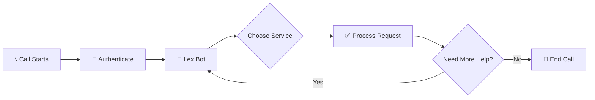

---

## 🔐 Authentication Flow

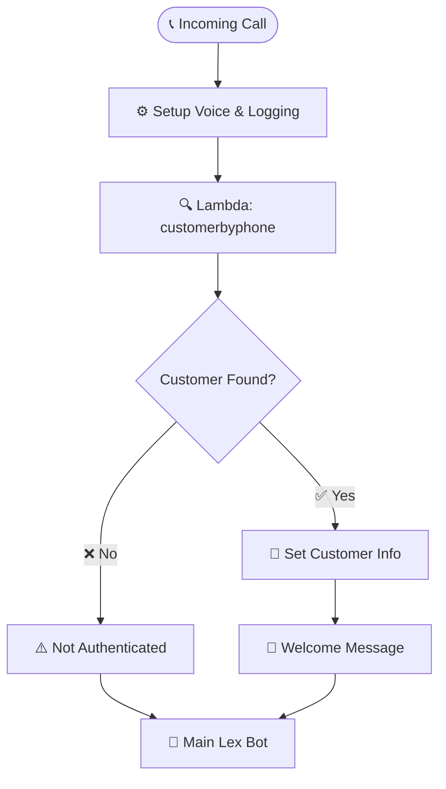

---

## 🎯 Available Services (Intents)

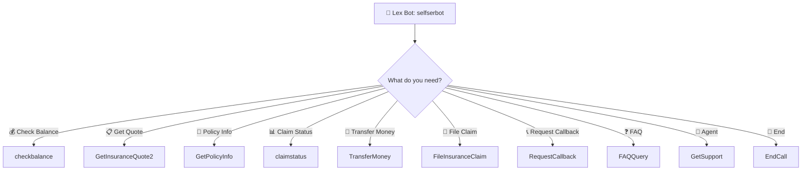

---

## 💰 Check Balance Flow

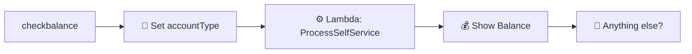

---

## 📋 Get Insurance Quote Flow

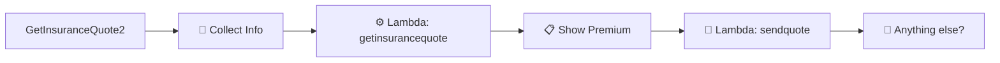

---

## 📄 Get Policy Info Flow

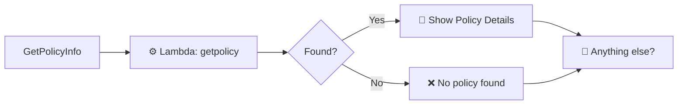

---

## 📊 Check Claim Status Flow

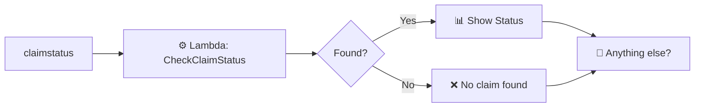

---

## 💸 Self-Service Actions

### Transfer Money
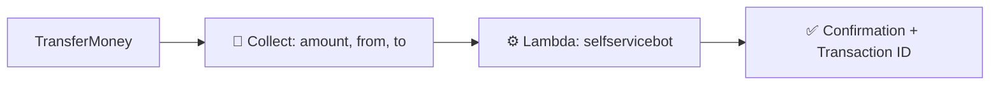

### File Insurance Claim
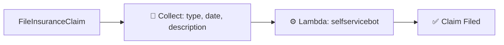

### Request Callback
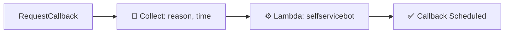

---

## ❓ FAQ & 👤 Agent Transfer

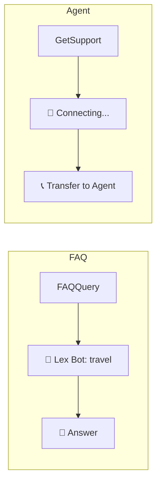

---

## 🗺️ Complete Flow Summary

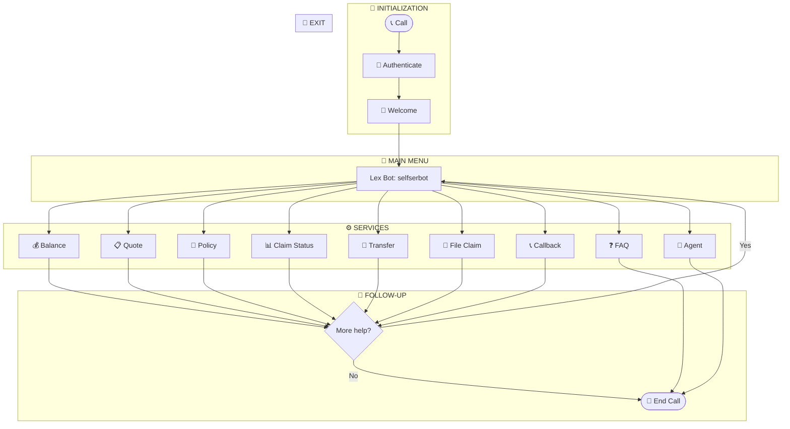

---

## 📦 Lambda Functions

| Function | Purpose |
|----------|---------|
| `customerbyphone` | Authenticate customer by phone |
| `ProcessSelfService` | Process balance inquiries |
| `getinsurancequote` | Calculate insurance quotes |
| `sendquote` | Email quote to customer |
| `getpolicy` | Retrieve policy information |
| `CheckClaimStatus` | Check claim status |
| `selfservicebot` | Handle transfers, claims, callbacks |

---

## 🤖 Lex Bots

| Bot | Purpose |
|-----|---------|
| `selfserbot` | Main intent recognition |
| `travel` | FAQ handling |

---

## 📝 Supported Intents

- `checkbalance` - Check account balance
- `GetInsuranceQuote2` - Get insurance quote
- `GetPolicyInfo` - Get policy information
- `claimstatus` - Check claim status
- `TransferMoney` - Transfer funds
- `FileInsuranceClaim` - File new claim
- `RequestCallback` - Request callback
- `FAQQuery` - Ask FAQ questions
- `GetSupport` - Transfer to agent
- `EndCall` - End the call
📸 Screenshots
DynamoDB Tables

Quote Email

Quote Completion Form

Purchase Confirmation

Create Lex Bots - Set up selfserbot and travel bots
Deploy Lambda Functions - Deploy all Lambda functions
Create DynamoDB Tables - Create the 8 required tables
Configure S3 - Host the quote website on S3
Setup SES - Configure email sending

Purchase Confirmation

